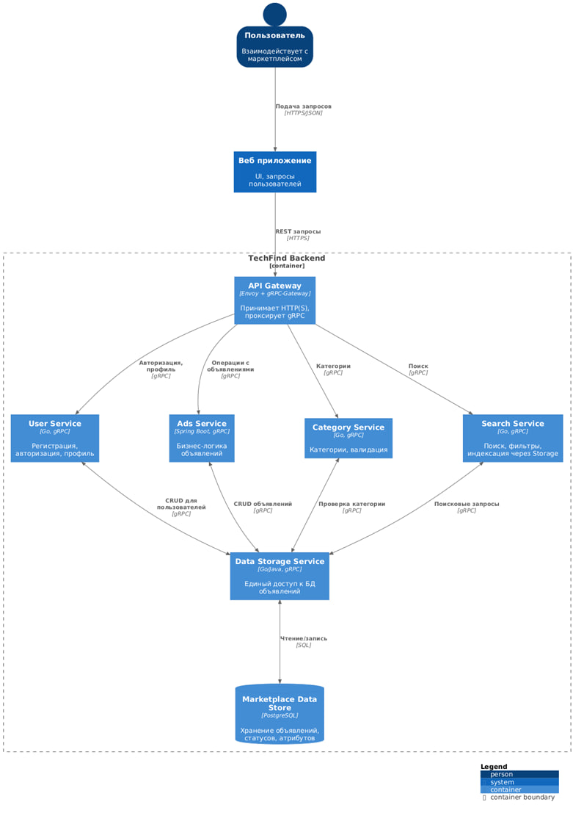

# advertisements-api

 
 
 

## Описание

[](https://app.swaggerhub.com/apis-docs/snowleopards/techfind-marketplace-api-gateway/1.1.0)

[](https://snow-leopards.atlassian.net/jira/software/projects/BB/boards/1/backlog)

`advertisements-api` — это API-сервис для работы с объявлениями.

## Архитектура

### api-gateway
REST API для клиентов. Принимает HTTP/JSON, валидирует запросы и проксирует их в backend по gRPC, возвращая ответы в JSON.

### ads-service
Доменная логика объявлений. Реализует операции CRUD для объявлений и через gRPC обращается к `advertisements-storage` для чтения и записи данных.

### category-service
Сервис категорий. Обрабатывает создание, получение, обновление и удаление категорий и проксирует запросы к `advertisements-storage` по gRPC.

### search-service
Сервис поиска объявлений. Принимает поисковые запросы (например, по title) и выполняет поиск через `advertisements-storage` (в текущей версии — SQL в Postgres, в будущем может быть заменён на поисковый движок).

### users-service
Сервис пользователей и авторизации. Отвечает за регистрацию, логин (JWT) и работу с профилем, а данные и проверку учетных данных выполняет через `advertisements-storage`.

### advertisements-storage
Единый сервис доступа к данным. Реализует gRPC API и содержит всю работу с Postgres (репозитории и SQL) для пользователей, категорий, объявлений и поиска.

### db (PostgreSQL)
База данных проекта. Хранит пользователей, категории и объявления, а также ограничения и индексы (email, alias и т.п.).

### Схема архитектуры



## Настройка переменных окружения

Перед запуском необходимо создать файл `.env` в корне проекта.

### 1. Создайте в корне проекта файл`.env` и заполните его

```
DB_USER=postgres
DB_PASSWORD=1234
DB_NAME=ads
JWT_SECRET=SuperSecretKeyForJWT@2024!WithSecureRandomBytes12345
```

### Запуск через Docker Compose(первый раз)

```bash
docker compose up -d --build
```

### Обычный запуск (после первого раза)

```bash
docker compose up -d
```

### Остановка приложения

```bash
docker compose down
```

### Перезапуск без пересборки

```bash
docker compose restart
```

### Проверка статуса контейнеров

```bash
docker compose ps
```

### Просмотр логов

```bash
docker compose logs -f
```

### Генерация Go pb файлов из proto через make

```
make proto-storage
make proto-category
make proto-search
make proto-user
make proto-gateway
make proto-all
```

### Команда проекта

```
Каберов Никита
Бубеков Даниль
Макарова Ксения
Пасашков Юрий
Чурпанова Айсура
```

### Лицензия
MIT

